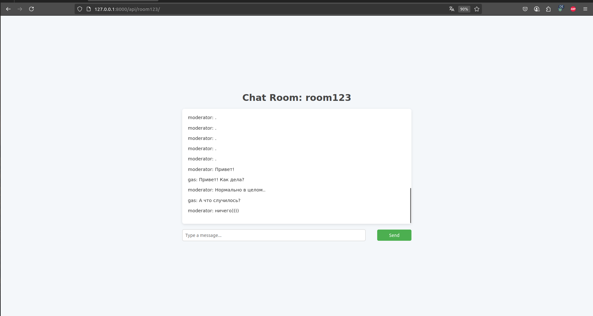

# WebSocket Chat with Django REST Framework & Channels

  
*Основная страница чата*

---

## Описание проекта

Это простой чат-сервис, реализованный на Django REST Framework и Django Channels с поддержкой WebSocket.  

Основные возможности:
- Создание и управление комнатами (с паролем и без)
- Вход в комнату с проверкой пароля
- Реализация обмена сообщениями через WebSocket в реальном времени
- Аутентификация пользователей через токены

---

## Технологии

- Python 3.10+
- Django 5.x
- Django REST Framework
- WebSockets
- pytest + pytest-asyncio
- PostgreSQL 

---

## Документация API (Swagger)

Для удобства работы с API подключена автогенерируемая документация Swagger UI.
Доступна по адресу: http://localhost:8000/swagger/

## Пример логов сервера
"127.0.0.1:50954 - - [17/Jul/2025:16:12:57] \"GET /api/room123/\" 200"  
"127.0.0.1:50958 - - [17/Jul/2025:16:12:57] \"WSCONNECTING /ws/chat/room123/\" - -"  
"[CONNECT] Пользователь moderator подключается к комнате room123"  
"[DEBUG] Проверка участия moderator в комнате room123: True"  
"[SUCCESS] Пользователь moderator успешно подключился к комнате room123"  
"[DEBUG] Найдено 30 сообщений для комнаты room123"  
"[RECEIVE] Сообщение от пользователя moderator: {\"message\":\"куку\"}"  
"[DB] Сообщение сохранено в базе: куку"  
"[BROADCAST] Сообщение отправлено в чат room123"  
"[SEND] Отправка сообщения пользователям в комнате room123"

Пояснение:  
"[CONNECT] — пользователь подключился через WebSocket"  
"[DEBUG] — отладочная информация по отправке и загрузке сообщений"  
"[DB] — сохранение сообщений в базу данных"  
"[BROADCAST] — рассылка сообщений в реальном времени"


## Запуск проекта

# Клонировать репозиторий
```bash
git clone https://github.com/GvozdevMaxim/django-websocket-chat.git
cd django-websocket-chat
```
# Создать и активировать виртуальное окружение
```bash
python -m venv .venv
source .venv/bin/activate  # Linux/macOS
# .venv\Scripts\activate   # Windows
```

# Установить зависимости
```bash
pip install -r requirements.txt
```
# Запустить миграции
```bash
python manage.py migrate
```

# Запустить сервер
```bash
daphne -p 8000 chat.asgi:application
```

# 1. Зарегистрируйте пользователя

Для создания нового пользователя используйте стандартный API-эндпоинт регистрации:
POST http://localhost:8000/auth/users/

После успешной регистрации получите токен.
POST http://localhost:8000/auth/token/login/
```json
Content-Type: application/json

{
"username": "testuser",
"password": "testpass"
}
```

# 2. Создайте комнату

Используйте эндпоинт для создания комнаты, передавая имя и  пароль:
POST http://localhost:8000/api/createroom/
```json
Authorization: Token <ваш_токен>
Content-Type: application/json

{
"name": "room1",
"password": "secret"
}
```
Ответ вернет данные новой комнаты.

# 1. Создайте суперпользователя
```bash
python3 manage.py createsuperuser
```
Перейдите по адресу:  
`http://localhost:8000/admin/`  

Войдите под учетной записью с правами администратора.
Добавьте администратора в ранее созданную комнату это позволит протестировать чат прямо из браузера.

Перейдите по адресу http://127.0.0.1:8000/api/<ИМЯ КОМНАТЫ>/

Теперь вы можете отправлять сообщения в чат прямо из браузера!
Так же можно воспользоваться плагином SimpleWebSocketPlugin:
https://chromewebstore.google.com/detail/simple-websocket-client/pfdhoblngboilpfeibdedpjgfnlcodoo?pli=1

Заполняете следующими данными:
URL: ws://localhost:8000/ws/chat/<Ваша комната>/?token=<ваш токен>
request:

```json
{
"message": "your message!"
}
```
Спасибо, что посмотрели проект!
Буду рад вашим отзывам и вкладом в развитие.
